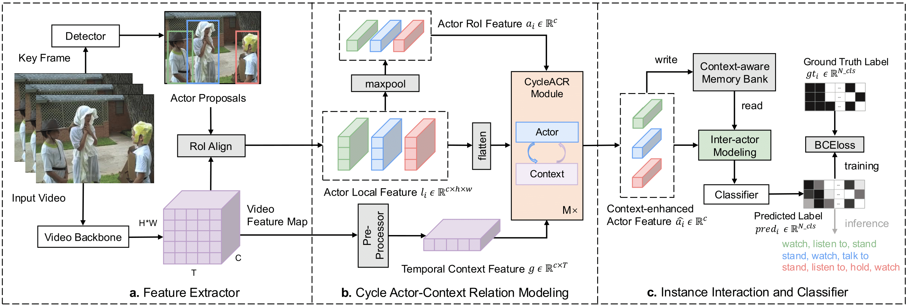

# Official PyTorch Implementation of CycleACR



> [**CycleACR: Cycle Modeling of Actor-Context Relations for Video Action Detection**](https://arxiv.org/abs/2303.16118)<br>[Lei Chen](https://github.com/MiaSanLei), [Zhan Tong](https://github.com/yztongzhan), [Yibing Song](https://ybsong00.github.io/), Gangshan Wu, [Limin Wang](http://wanglimin.github.io/)<br>

## News
- ```2025.08.11``` Code and pre-trained models are available now!
- ```2025.07.30``` Our CycleACR is accepted by T-PAMI 2025! 🎉

## Installation 

Please find installation instructions in [INSTALL.md](INSTALL.md).

## Data Preparation

Please follow the instructions in [AlphAction DATA.md](https://github.com/MVIG-SJTU/AlphAction/blob/master/DATA.md) to prepare AVA dataset.

## Model Zoo

| method    | config                                               | backbone          | pre-train                                                    | AVA mAP  | model                                                        |
| --------- | ---------------------------------------------------- | ----------------- | ------------------------------------------------------------ | ---- | ------------------------------------------------------------ |
| CycleACR  | [cfg](config_files/slowfast_r101_8x8f_cycleacr.yaml) | SlowFast-R101-8x8 | [K700](https://drive.google.com/file/d/1JDQLyyL-GFd3qi0S31Mdt5oNmUXnyJza/view) | 34.0 | [link](https://huggingface.co/MiaSanLei/cycleacr_slowfast_r101_8x8) |

Note: The code and weights for VideoMAE-ViT-L backbone will be released soon.

## Training

```
python -m torch.distributed.launch --nproc_per_node=8 train_net.py --config-file "config_files/config_file.yaml" --transfer --no-head --use-tfboard --skip-final-test
```

## Inference

```
python -m torch.distributed.launch --nproc_per_node=8 test_net.py --config-file "config_files/config_file.yaml" MODEL.WEIGHT "path/to/model/weight"
```

## Acknowledgement

This project is built upon [AlphaAction](https://github.com/MVIG-SJTU/AlphAction) and [maskrcnn-benchmark](https://github.com/facebookresearch/maskrcnn-benchmark). Thanks to the contributors of these great codebases. We also thankfully acknowledge the computing resource support of Tencent Corporation for this project. 

## Citation

If you find this project useful, please feel free to leave a star and cite our paper:

```
@article{chen2025cycleacr,
  title={Cycleacr: Cycle modeling of actor-context relations for video action detection},
  author={Chen, Lei and Tong, Zhan and Song, Yibing and Wu, Gangshan and Wang, Limin},
  journal={IEEE Transactions on Pattern Analysis and Machine Intelligence},
  year={2025},
  publisher={IEEE}
}

@article{chen2023cycleacr,
  title={CycleACR: Cycle Modeling of Actor-Context Relations for Video Action Detection},
  author={Chen, Lei and Tong, Zhan and Song, Yibing and Wu, Gangshan and Wang, Limin},
  journal={arXiv preprint arXiv:2303.16118},
  year={2023}
}
```